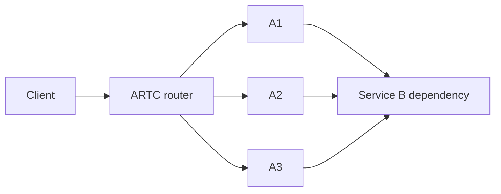
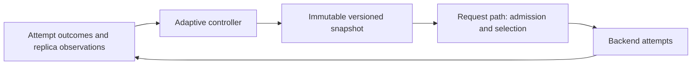
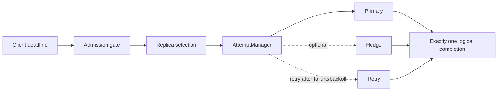
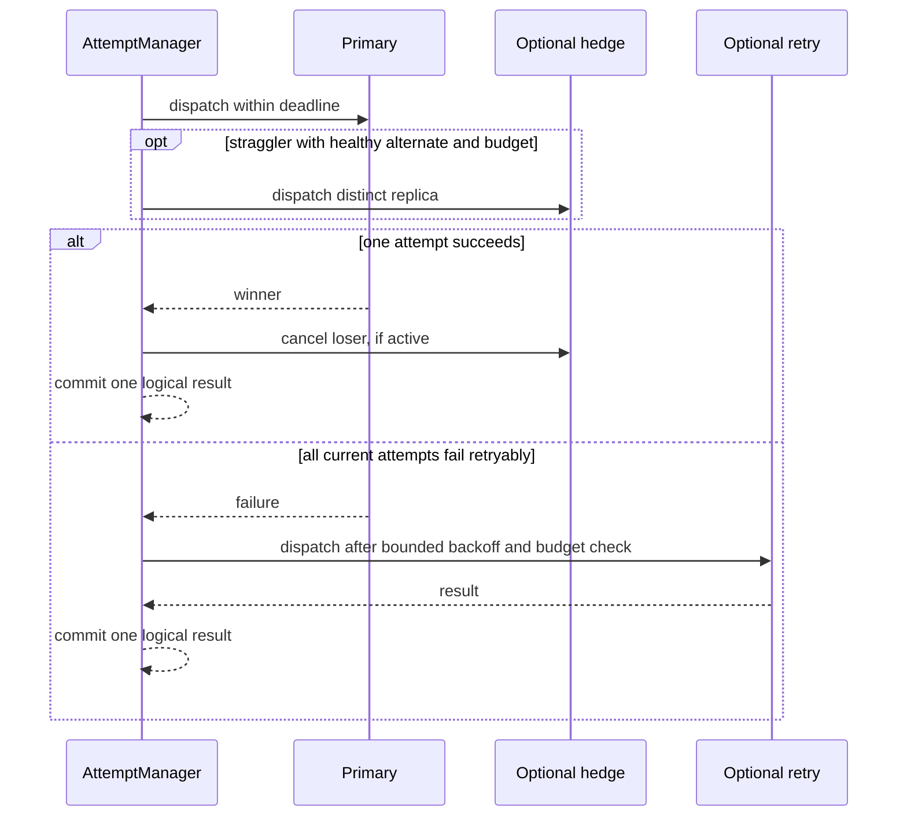
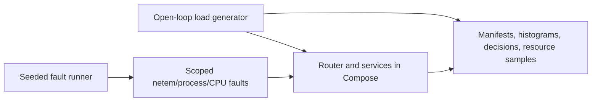

# ARTC — Adaptive RPC Tail Controller

ARTC is a C++23 unary gRPC traffic layer that routes requests across a static replica pool. It combines deadline-aware admission, replica-health selection, adaptive concurrency, bounded hedging, and idempotency-aware retries. The project pairs that runtime with an open-loop benchmark and a scoped Docker fault lab so latency, goodput, rejections, resource use, and extra backend work stay visible together.

## Verified results

The most repeatable Phase 4 result is the one-hour healthy soak: 900,000 of 900,000 scheduled requests succeeded at 250 requests/s, with zero rejections, zero deadline misses, and attempt amplification of 1.00. Its 900,000 latency observations measured p50 1.123 ms, p95 1.529 ms, and p99 1.732 ms. Resource analysis found no monotonic drift across 325 samples; file descriptors, threads, sockets, and process count were stable. The evidence is in [`phase4_healthy_soak_20261001`](artifacts/runs/phase4_healthy_soak_20261001/phase2-soak/).

The bounded faulted soak ran for 20 minutes at the same offered rate while A2 had 75 ms egress delay for 60 seconds. All 300,000 requests succeeded with amplification 1.00; the fault was removed, 200 recovery probes succeeded, and the analyzer found no monotonic resource growth across 108 samples. RSS rose by 2,360 KiB between analyzer medians; FD/thread/socket/process counts stayed at 12/21/5/22. See [`phase4_faulted_soak_20261001`](artifacts/runs/phase4_faulted_soak_20261001/phase2-soak/).

These results describe the documented single-host Compose environment. The project does not claim universal production readiness or a stable p999 result. The histogram code now withholds p999 until 1,000,000 observations; older Phase 4 manifests can contain a descriptive p999 because they were generated with the earlier 100,000-sample internal threshold. We do not report those sub-million values as RPC p999 claims.

## Architecture











The request path uses `AttemptManager` to separate a logical RPC from backend attempts. The controller publishes immutable snapshots that readers can load without taking its update lock. The fault runner verifies Compose project/service labels before acting, records seeded events, restores faults in its exit path, and verifies project cleanup.

## Correctness and bounded work

- Unknown RPC methods default to non-idempotent with one attempt. Automatic duplicate attempts require an explicit idempotency policy.
- Runtime limits are at most two active attempts and three total attempts per logical request. Hedge and retry budgets are separate.
- Every logical request has one terminal transition. Deadlines are monotonic; the retry path checks expiry both when its timer fires and at the backend dispatch fence.
- Admission permits account one logical request; replica leases account individual attempts. Shutdown closes dispatch, cancels timers/calls, and waits for callback drain.
- Cancellation is best effort. A backend that ignores cancellation can keep doing work after the caller receives a result; that work is tracked separately.
- Configuration is validated before serving. Phase 4 rejected 31 malformed configurations and passed the startup ordering matrix, including late replica/dependency cases and 20 start/stop cycles.

The new deterministic deadline/retry test forces both relevant orders: deadline wins while the retry callback is queued, and expiry occurs while the retry callback is paused at the dispatch fence. It asserts one terminal result, one primary attempt, no retry token consumption, no active attempts/timers, and balanced admission permits.

## Failure laboratory

The explicit catalog and Phase 4 dispositions are in [`docs/failures/04_FAILURE_MODEL_AND_FAULT_LAB.md`](docs/failures/04_FAILURE_MODEL_AND_FAULT_LAB.md) and [`phase4_fault_coverage.csv`](docs/failures/phase4_fault_coverage.csv). The CSV covers every catalog ID plus 13 risk-selected pairwise interactions. It labels unsupported capabilities `NOT APPLICABLE`, unrun cases `NOT RUN`, and narrower measured cases `PASS WITH LIMITATION`.

Selected seeded incidents validated:

- A2 CPU stress-worker injection + Service B slowdown + a load step. Fault application and cleanup were logged, but no CPU quota or direct A2 utilization sample was captured, so a service-level saturation effect is not established.
- A2 packet loss + cluster UNAVAILABLE responses + retry pressure + an A3 restart.
- A2 straggling + hedging + short deadlines + a load increase.
- Replica restart/recovery + a traffic spike, and all-replica slowdown + a load step.

The valid incident event logs record applied faults, cleanup, and recovery. Earlier failed or metadata-invalid attempts remain preserved but are not counted as passes. Unsupported network modes, remote telemetry failures, and controlled ARTC memory/FD exhaustion remain visible as limitations in the catalog.

## Benchmark method and representative measurements

The generator schedules requests independently of completion, records scheduled time, actual issue, completion, outcome, and backend attempt count, and invalidates runs when issue lag or generator saturation exceeds limits. Raw HDR-style histograms and per-run manifests are retained. The full evidence is descriptive: short policy rows are single trials and are not statistically ranked.

| Scenario | Offered / sample | p50 / p95 / p99 | Goodput / rejected | Attempt amplification | Reading |
|---|---:|---:|---:|---:|---|
| Healthy adaptive soak | 250 RPS / 900,000 | 1.123 / 1.529 / 1.732 ms | 250 RPS / 0 | 1.00 | One-hour run; generator valid. |
| A2 straggler, unhedged | 150 RPS / 450 | 1.093 / 153.983 / 154.111 ms | 450 / 0 | 1.00 | One exploratory trial. |
| A2 straggler, 5 ms hedge | 150 RPS / 450 | 1.126 / 8.919 / 9.063 ms | 450 / 0 | 1.33 | One exploratory trial; 150 hedge attempts. The observed p99 delta is not a repeated headline estimate. |
| Full policy under one A2 straggler | 200 RPS / 4,000 | 2.089 / 2.685 / 24.639 ms | 4,000 / 0 | 1.022 | 88 hedge attempts; one run. |
| Service B 50 ms slowdown at 2,000 RPS | 2,000 RPS / 40,000 | 0.394 / 53.567 / 56.703 ms | 3,378 (168.9/s) / 36,622 | 1.00 per admitted | Percentiles pool successes and fast rejections; no success-only histogram exists. The run demonstrates load shedding under this limit and target setting, not protection versus an unbounded baseline. |
| All replicas slowed | 200 RPS / 4,000 | 0.862 / 1.143 / 1.258 ms | 0 / 4,000 | No attempts admitted | No global capacity was available to route around. The low latency is rejection, not a performance win. |
| Faulted soak | 250 RPS / 300,000 | 1.234 / 2.339 / 2.683 ms | 250 RPS / 0 | 1.00 | 20 minutes; A2 delay applied and removed; 934 observations exceeded 100 ms; recovery probes passed. |

Percentiles are measured from scheduled arrival through completion. In rejection-heavy runs they include successful responses and rejections; they are not successful-response-only latency. Manifest `attempt_amplification` is attempts per issued logical request; `attempt_amplification_per_admitted` is the admitted-request ratio. A valid manifest may intentionally contain errors when `allow_errors` is true, so compare its integrity fields with `successful`, `rejected`, and status counts.

Additional negative results are retained:

- The manifest's `cpu_seconds_per_completed_request` is measured by `std::clock()` inside `artc_loadgen`; it is generator CPU, not router or backend CPU. The direct-A1 and router paths also differ in trailer handling, so those rows do not establish ARTC's CPU overhead. Router container CPU samples are retained, but the one-second `docker stats` monitor shares the host with the workload.
- The one-million-iteration release control microbenchmark measured the adaptive selector at 75 ns mean per call, versus a 34 ns clock-pair timing baseline. This shows selection has measurable computation cost; it does not estimate end-to-end healthy-request overhead.
- In 200-call cancellation-aware and cancellation-ignoring runs, both dispatched 67 hedges (1.335x attempts). The A2 service recorded 532 us of post-cancel work when honoring cancellation and 9,389,720 us when ignoring it. The results demonstrate best-effort cancellation and why attempt amplification alone does not measure wasted backend work.
- Under the same isolated-straggler setup, 20 ms and 50 ms hedge delays had worse p99 than 5 ms, with the same 1.33 amplification. This is a single sweep, not a universal hedge setting.
- One valid 8,000 RPS/300 ms paired run ([analysis](artifacts/runs/phase2-final-20260929-03/phase2/analysis.json)) recorded 90,652 successes with the gate off and 71,842 with it on; both reported zero deadline misses. This is one workload-specific negative result, not a general effect estimate. The later high-load rerun is invalid because attempt trailers were absent on 158,876 outcomes; those outcomes were status `DEADLINE_EXCEEDED` and the run is preserved but excluded from the comparison.
- The three repeated 1x/5x load cycles admitted every request with amplification 1.00. AIMD's concurrency limit kept increasing during low demand and reached its 512 cap by the second high wave. No controller retuning was done to make the trace look better.
- Four 50-call retry-storm runs depleted the configured retry budget and bounded further attempts; a cluster outage still had zero goodput. Retries contain extra work but cannot create backend capacity.

The policy ladder and ablation are one trial per row, use a fixed order, and have no separate warmup. Decision sampling is enabled every 100 requests for ARTC/adaptive rows but disabled for the four simple baselines. The sampling and order differences can affect p99, so the table is descriptive and the rows are not ranked. The same-host `docker stats` monitor adds some measurement work.

The one-million-iteration control microbenchmark measured, in its release build, mean selector 75 ns, admission 20 ns, snapshot read 20 ns, and controller update 257 ns. Callgrind profiles of that microbenchmark and one deterministic retry/deadline lifecycle test are in `artifacts/runs/phase4_control_profile_20261001/`. `perf` hardware counters were unavailable because the host sets `perf_event_paranoid=4`; no host setting was changed. These are focused control/lifecycle profiles, not a production flamegraph. Benchmark manifests record the base git SHA and `worktree_dirty=true`; the immutable lab image was inspected as `sha256:688e06686cdb1f918baaf60a12505cf92518b7a2b28862a70857740b38ca3613`, created before the Phase 4 runs. Since the runner did not record an image ID in each manifest, short-run results remain descriptive; a clean-checkout validation run is the source-provenance release check.

## Test and reproduction commands

Quick local build and tests:

```bash
cmake -S . -B build/debug -G Ninja -DCMAKE_BUILD_TYPE=Debug -DBUILD_TESTING=ON
cmake --build build/debug -j2
ctest --test-dir build/debug --output-on-failure
```

The canonical compiler, sanitizer, lifecycle, and Compose regression command is:

```bash
bash lab/run_phase3_gates.sh
```

Other bounded commands are kept separate:

```bash
bash lab/run_phase4_config_matrix.sh
bash lab/run_phase4_startup_matrix.sh
bash lab/run_phase4_state_fuzz.sh
bash lab/run_phase4_chaos.sh
ARTC_RUN_ID=phase4-oscillation ARTC_PHASE2_START_AT=OSCILLATION bash lab/run_phase2_experiments.sh
bash lab/run_phase2_soak.sh
```

The seeded state-machine campaign replays 32 fixed seeds through five event types and asserts the manager bounds after each generated sequence. It completed in about four seconds; it is deterministic state-sequence testing, not libFuzzer or exhaustive state-space exploration.

The validation scripts require Linux, C++23, CMake/Ninja, Docker Compose, and the pinned dependencies. Docker is accessed without `sudo`; fault scripts do not change host interfaces or socket permissions. Build and runtime evidence is scoped to the single host described by [`phase4-benchmark-environment.txt`](artifacts/reviews/phase4-benchmark-environment.txt).

## Support boundary

**Supported:** Linux; C++23; unary gRPC; statically configured replica pool; one ARTC process; in-memory controller state; explicit idempotency policy; bounded per-request hedge/retry behavior.

**Not implemented:** streaming RPCs; dynamic discovery; distributed controller state; cross-region routing; multi-instance coordination; production mTLS policy; Kubernetes integration; external telemetry exporters/collectors; a live dashboard.

## Repository guide

- [`src/app/services.cc`](src/app/services.cc): gRPC services, request lifecycle, and `AttemptManager`.
- [`src/control/phase2.cc`](src/control/phase2.cc): controller, admission, replica health, and immutable snapshots.
- [`src/routing/selector.cc`](src/routing/selector.cc): routing policies and replica leases.
- [`src/bench/`](src/bench/): open-loop generator and control microbenchmark.
- [`lab/`](lab/): Compose topology, validation runners, chaos, and analysis.
- [`docs/architecture/`](docs/architecture/): architecture, invariants, gates, operations, and traceability.
- [`docs/interview/13_INTERVIEW_READINESS.md`](docs/interview/13_INTERVIEW_READINESS.md): evidence-based interview notes and tradeoffs.
